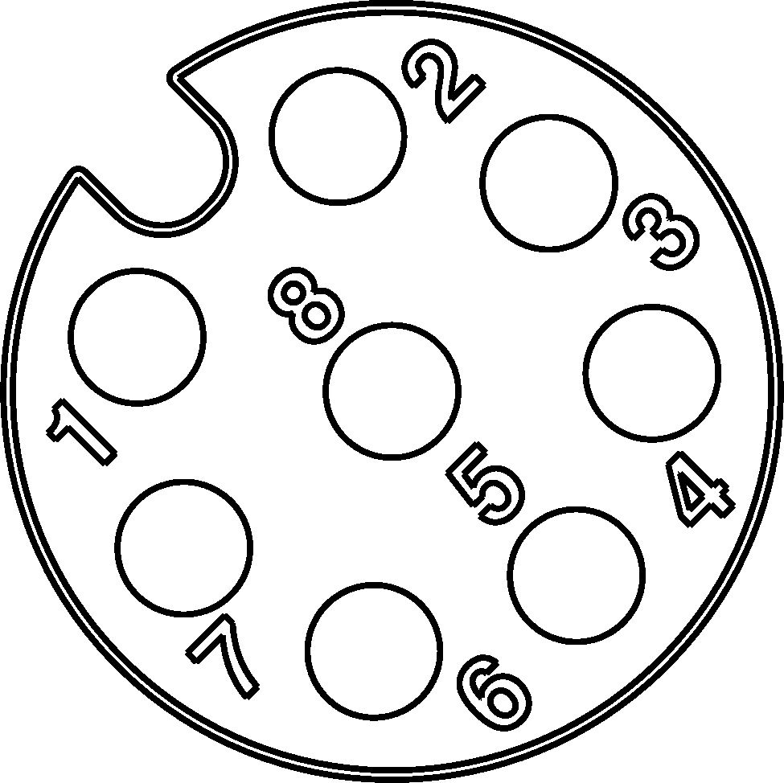

# PMR radio for R124

# Connection to R124

## Connection in 124 A-1
Connection as R112. 

| Cont. |     | Cont. |           | Cont. |      |
|-------|-----|-------|-----------|-------|------|
| a1    | PTT | b1    | +26V      | c1    |      |
| a2    |     | b2    | Speaker + | c2    | GND  |
| a3    |     | b3    | MIC-      | c3    | MIC+ |
| a4    |     | b4    |           | c4    |      |
| a5    |     | b5    |           | c5    |      |
| a6    |     | b6    |           | c6    |      |
| a7    |     | b7    |           | c7    |      |
| a8    |     | b8    |           | c8    |      |
| a9    |     | b9    |           | c9    |      |
| a0    |     | b0    |           | c0    |      |

## M12 Connector

| M12 | Function | Wire color |
|-----|----------|------------|
| 1   | +26V     | Black      |
| 2   | PTT      | Brown      |
| 3   | Mic+     | Red        |
| 4   | Mic-     | orange     |
| 5   | NC       | Yellow     |
| 6   | Speaker  | Green      |
| 7   | GND      | Blue       |
| 8   | NC       | Violet     |

