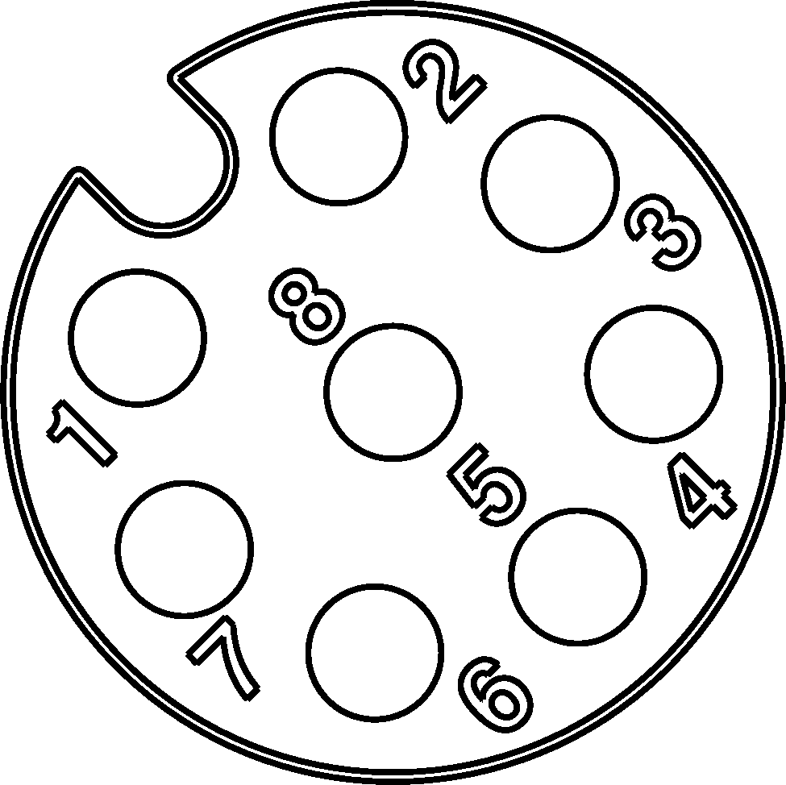

# PMR radio for R124

# Connection to R124

## Connection in R124 A-1
### Connection as R112. 

| Cont. |                | Cont. |                     | Cont. |                |
|-------|----------------|-------|---------------------|-------|----------------|
| a1    |                | b1    | +26V   Black    | c1    |                |
| a2    |                | b2    | Speaker   Green | c2    | GND   Blue |
| a3    | PTT  Brown | b3    | MIC-  Orange    | c3    | MIC+   Red |
| a4    |                | b4    |                     | c4    |                |
| a5    |                | b5    |                     | c5    |                |
| a6    |                | b6    |                     | c6    |                |
| a7    |                | b7    |                     | c7    |                |
| a8    |                | b8    |                     | c8    |                |
| a9    |                | b9    |                     | c9    |                |
| a0    |                | b0    |                     | c0    |                |

### Connection as R123. 

| Cont. |                     | Cont. |                  | Cont. |                  |
|-------|---------------------|-------|------------------|-------|------------------|
| a1    |                     | b1    | +26V   Black | c1    |                  |
| a2    |                     | b2    |                  | c2    | GND   Blue   |
| a3    |                     | b3    |                  | c3    |                  |
| a4    |                     | b4    |                  | c4    |                  |
| a5    |                     | b5    |                  | c5    |                  |
| a6    |                     | b6    |                  | c6    |                  |
| a7    |                     | b7    |                  | c7    |                  |
| a8    |                     | b8    |                  | c8    |                  |
| a9    |                     | b9    |                  | c9    | PTT  Brown   |
| a0    | Speaker   Green | b0    | MIC+   Red   | c0    | MIC-  Orange |

## M12 Connector

| M12 | Function | Wire color |
|-----|----------|------------|
| 1   | +26V     | Black      |
| 2   | PTT      | Brown      |
| 3   | Mic+     | Red        |
| 4   | Mic-     | Orange     |
| 5   | NC       | Yellow     |
| 6   | Speaker  | Green      |
| 7   | GND      | Blue       |
| 8   | NC       | Violet     |

## Updates for v2

- Add resistors to feedback of speaker amplifier to add gain
- Lower values of resistors in feedback of mic amplifier to make it stable
- Lower gain of mic amplifier
- Add connection for BT audio input/output for hands free
  - Make it as module to 2.54mm  pin header
  - ESP32 and ES8388 look like good choice

# PMR 446 Technical Specification

- Transmit Power 500mW Estimated (REP)
- Bandwidth 12.5kHz 
- Antenna Fixed, non removable. Impossible to connect to external aerial.
- Frequency Modulation and digital modes.
- User Separation CTCSS, DCS, digital signalling.
- Frequencies (Simplex TX=RX)

## Channels
| PMR446 Channel | Frequency (MHz) |
|----------------|-----------------|
| 1              | 446,00625       | 
| 2              | 446,01875       |
| 3              | 446,03125       |
| 4              | 446,04375       |
| 5              | 446,05625       |
| 6              | 446,06875       |
| 7              | 446,08125       |
| 8              | 446,09375       |
| 9              | 446,10625       |
| 10             | 446,11875       |
| 11             | 446,13125       |
| 12             | 446,14375       |
| 13             | 446,15625       |
| 14             | 446,16875       |
| 15             | 446,18125       |
| 16             | 446,19375       |

## CTCSS codes

| Code | Tone Hz | Code | Tone Hz | Code | Tone Hz |
|------|---------|------|---------|------|---------|
| 0    | Off     | 13   | 103.5   | 26   | 162.2   |
| 1    | 67.0    | 14 	 | 107.2   | 27   | 167.9   |
| 2    | 71.9    | 15 	 | 110.9   | 28   | 173.8   |
| 3    | 74.4    | 16   | 114.8   | 29   | 179.9   |
| 4    | 77.0    | 17   | 118.8   | 30   | 186.2   |
| 5    | 79.7    | 18   | 123.0   | 31   | 192.8   |
| 6    | 82.5    | 19   | 127.3   | 32   | 203.5   |
| 7    | 85.4    | 20   | 131.8   | 33   | 210.7   |
| 8    | 88.5    | 21   | 136.5   | 34   | 218.1   |
| 9    | 91.5    | 22   | 141.3   | 35   | 225.7   |
| 10   | 94.8    | 23   | 146.2   | 36   | 233.6   |
| 11   | 97.4    | 24   | 151.4   | 37   | 241.8   |
| 12   | 100.0   | 25   | 156.7   | 38   | 250.3   |

# R124 Notes

## Connectors

### R124 A-1

| Cont. |                                              | Cont. |                      | Cont. |               |
|-------|----------------------------------------------|-------|----------------------|-------|---------------|
| a1    | NC                                           | b1    | +26V                 | c1    | NC            |
| a2    | NC                                           | b2    | R112 Speaker         | c2    | GND           |
| a3    | R112 PTT                                     | b3    | R112 MIC-            | c3    | MIC+          |
| a4    | A-2 R112 Speaker                             | b4    | A-2 R123 MIC+        | c4    | A-2 R112 MIC+ |
| a5    | A-2 R123 Speaker                             | b5    | A-2 R123 MIC-        | c5    | A-2 R112 MIC- |
| a6    | Tangenta Speaker                             | b6    | Tangenta Intercom PB | c6    | Tangenta GND  |
| a7    | Tangenta MIC+                                | b7    | Tangenta MIC-        | c7    | Tangenta PTT  |
| a8    | Intercom Speaker for  A-2, A-3, A-4, A-5 | b8    | Intercom PB          | c8    | GND           |
| a9    | +22V for  A-2, A-3, A-4, A-5             | b9    | Intercom MIC to PA   | c9    | R123 PTT      |
| a0    | R123 Speaker                                 | b0    | R123 MIC+            | c0    | R123 MIC-     |

Intercom MIC to PA - Amplified microphone

### R124 A-2

| Cont. |                                  | Cont. |                  | 
|-------|----------------------------------|-------|------------------|
| a1    | A-1 R112 MIC+                    | b1    | A-1 R123 MIC+    |
| a2    | A-1 R112 MIC-                    | b2    | A-1 R123 MIC-    |
| a3    | Tangenta PTT                     | b3    | Tangenta MIC+    |
| a4    | Intercom MIC to PA               | b4    | Tangenta MIC-    |
| a5    | GND                              | b5    | A-1 R112 Speaker |
| a6    | +22V for  A-2, A-3, A-4, A-5 | b6    | A-1 R112 PTT     |
| a7    | Tangenta Speaker                 | b7    | A-1 R123 Speaker |
| a8    | Intercom Speaker                 | b8    | A-1 R123 PTT     |

# Architektura SDR Transceiveru

## 1. Hodinová synchronizační doména (Clock Tree)

* **Hlavní oscilátor:** Společné 36MHz TCXO pro celou desku.
* **Distribuce signálu (Hardware Split):**
* Větev pro mikrokontrolér vedena přímo do vstupu `OSC_IN` s plnou logickou úrovní.
* Větev pro RF front-end vedena do vstupu `XTB` přes tlumicí člen (např. odporový dělič s AC vazbou), aby nebyla překročena maximální povolená špičková úroveň 1.8 Vpp. Vstup `XTA` zůstává nezapojený.

* **Zpracování beze skluzu:** Všechny vzorkovací frekvence v systému (I/Q data i audio) jsou odvozeny čistým celočíselným dělením z 36 MHz. Tím je zcela eliminována nutnost použití asynchronního převzorkování (ASRC) nebo zlomkových PLL.

## 2. RF Front-End (Semtech SX1255)

* **Architektura:** Zero-IF transceiver.

* **Digitální rozhraní:** Využit integrovaný Digital Bridge v režimu **Mode B2** (I2S kompatibilní datový tok, multiplexované I a Q signály na jednom pinu).

* **Decimace na čipu:** Nastavena na hodnotu **1536** pomocí 1. sady parametrů ($\text{MANT}=8$).

* **Vzorkovací frekvence (I/Q):** Odvozena z krystalu na $23.4375\text{ kHz}$.

* **Formát rámce:** Parametr `CLK_OUT/XTAL` nastaven na dělení 24. Výstupní hodiny $f_{CLK\_OUT}$ běží na $1.5\text{ MHz}$, což generuje standardní I2S rámec o délce 64 pulzů (32 bitů na složku). Do DMA mikrokontroléru se ukládá pouze 16 bitů (poskytujících dynamický rozsah cca $98\text{ dB}$).

## 3. Baseband a DSP (STM32H725RGV6)

* **Sběr rozhraní:** Vyčítání SX1255 probíhá přes standardní I2S (nebo SAI) periferii v režimu Master. MCU generuje BCLK a WS.
* **Matematická koprocese:**
* **CORDIC:** Využit pro hardwarově akcelerovanou fázovou a amplitudovou demodulaci. Vstupní 16bitová data (formát Q1.15) z DMA se prokládají do jediného 32bitového slova pro zápis do `WDATA` registru koprocesoru.

* **FMAC:** K dispozici jako Filter Mathematical Accelerator pro dodatečné rychlé kanálové FIR/IIR filtrování před samotnou demodulací.

* **Firmware:** Napsán v jazyce Rust nad asynchronním frameworkem Embassy (využívající `embassy-stm32` a `embassy-executor`), což umožňuje bezblokující řízení I2S DMA přeskoků.

## 4. Audio Front-End a koncový stupeň

* **Audio Kodek:** TAC5142 v režimu Slave. BCLK a WS generuje STM32H7. Vzorkovací frekvence audia je buď nativních $23.4375\text{ kHz}$, nebo po jedné decimaci/half-band filtru $11.71875\text{ kHz}$.
* **Mikrofonní vstup:** Sovětské uhlíkové vložky nahrazeny moderními elektretovými nebo dynamickými kapslemi. Předpětí (bias) je řešeno standardně přes vývod `MICBIAS` kodeku TAC5142 s vazbou do diferenciálního vstupu PGA.
* **Audio koncový stupeň:** Zesilovač TPA6120A2 řídící sluchátka v sovětské tankistické kukle.
* **Napájení:** Asymetrické (až 30 V) z dedikovaného step-up DC/DC měniče (vstup 5 V). Výstupní napětí z měniče bude možné dynamicky řídit (princip třídy G/H) pro maximalizaci účinnosti PA na základě reálného rozkmitu.
* **Virtuální střed:** Realizován ratiometrickým odporovým děličem z DC/DC napájení, který je posílen přes volný operační zesilovač v zapojení napěťového sledovače. Toto zajišťuje tvrdý střed s nízkou výstupní impedancí (odstranění přechodových subsonických rázů a přeslechů).
* **Specifika CFA topologie:** TPA6120A2 je zesilovač s proudovou zpětnou vazbou. Zpětnovazební rezistor $R_f$ má fixní hodnotu $1\text{ k}\Omega$ a absolutně se vynechává jakákoliv kapacita v paralelní zpětnovazební větvi. Na DPS je striktně odstraněn měděný polygon pod piny invertujících vstupů (IN-). Výstup je oddělen sériovým blokovacím DC kondenzátorem $220\ \mu\text{F}$.

## 5. RF Koncový stupeň (Transmitter PA)

* **Výkonový stupeň:** InGaP HBT tranzistor Guerrilla RF GRF5504 vybuzený na kompresní hranu, dodávající na konektor výkon $34.8\text{ dBm}$ (zhruba $3\text{ W}$), což je ideální pro sdílené kmitočty v ČR ($448\text{ MHz} / 449\text{ MHz}$).
* **Výstupní filtrace:** Modifikovaný dolní propust (LC Čebyšev), kde jsou nuly přenosu (LC pasti) úmyslně a přesně naladěny na eliminaci 2. a 3. (případně 4.) harmonické. Tím je dosaženo extrémní strmosti přesně v pásmech, kam by komprimující GRF5504 produkoval největší intermodulační rušení, při zachování minimálního vložného útlumu v propustném pásmu.
